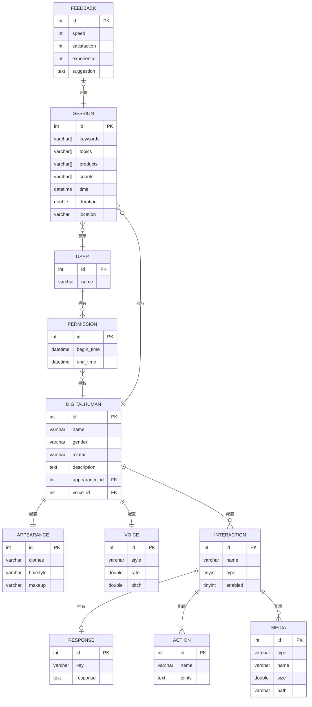

```mermaid
erDiagram
    USER ||--o{PERMISSION : "拥有"
    PERMISSION }o--|| DIGITALHUMAN : "授权"
    DIGITALHUMAN {
      int id PK
      varchar name
      varchar gender
      varchar avatar
      text description
      int appearance_id FK
      int voice_id FK
    }

    USER {
      int id PK  
      varchar name
    }

    PERMISSION {
      int id PK
      datetime begin_time
      datetime end_time
    }

    DIGITALHUMAN ||--|| APPEARANCE : "配置"

    APPEARANCE {
        int id PK
        varchar clothes
        varchar hairstyle  
        varchar makeup
    }

    DIGITALHUMAN ||--|| VOICE : "配置"

    VOICE {
        int id PK
        varchar style 
        double rate
        double pitch
    }

    DIGITALHUMAN ||--o{INTERACTION : "配置"
    INTERACTION ||--o| RESPONSE : "拥有"
    INTERACTION ||--|{ ACTION :"配置"
    
    
    INTERACTION{
        int id PK
        varchar name
        tinyint type
        tinyint enabled                     
    }
    
    ACTION{
        int id PK
        varchar name
        text joints
    }
    
    INTERACTION ||--o{ MEDIA:"配置"
    
    RESPONSE{
        int id PK
        varchar key
        text response    
    }
    
  
    MEDIA {
        int id PK
        varchar type
        varchar name
        double size
        varchar path 
    }
   
    FEEDBACK |o--|| SESSION : "评价"
    FEEDBACK {
        int id PK
        int speed
        int satisfaction
        int experience
        text suggestion 
    }
    SESSION }o--|| USER:"参与"
    SESSION }o--||DIGITALHUMAN:"参与"
    SESSION {
        int id PK  
        varchar[] keywords
        varchar[] topics 
        varchar[] products
        varchar[] counts
        datetime time
        double duration
        varchar location
    }
```
